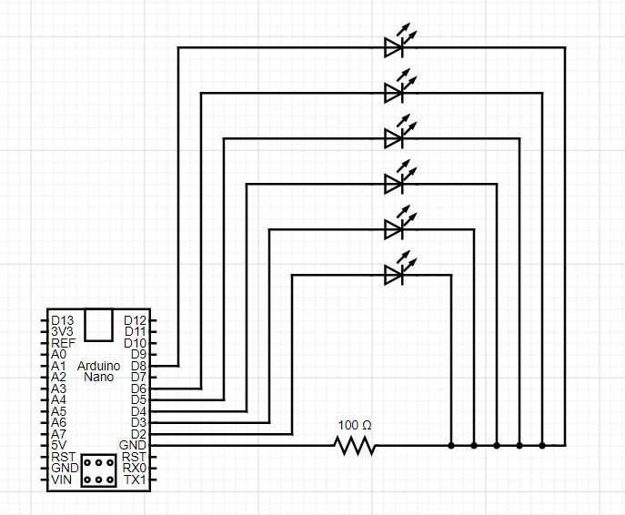
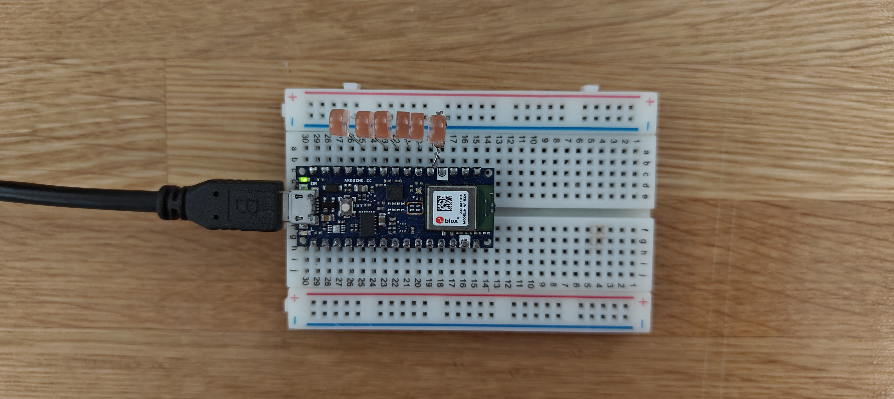
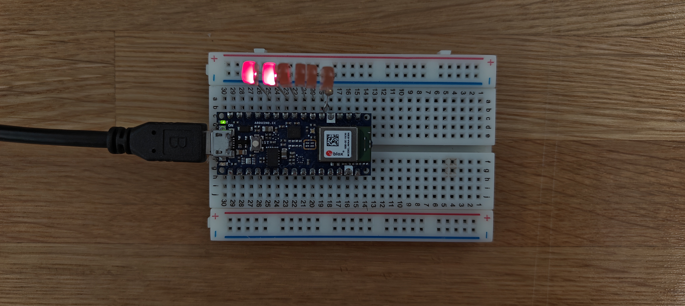
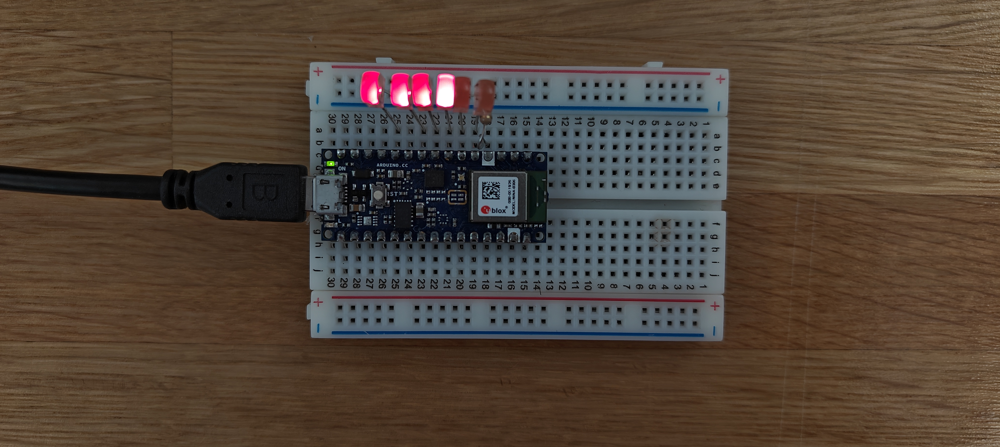
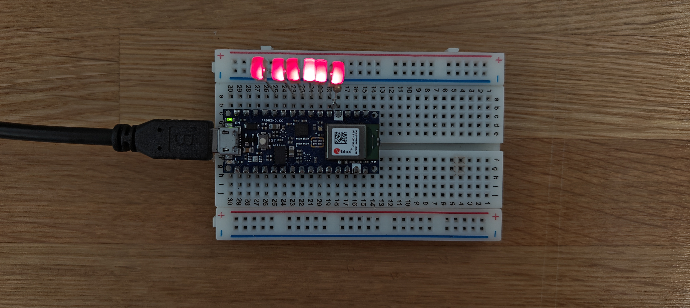

# ReadMe - HW10 Working Document

For my timepiece assignment, I've depicted the passage of time, in seconds, in the form of an LED progress bar. As seconds pass, the progress bar LED starts to light up one-by-one with each LED turning on after every 10 seconds. After a whole minute, all LEDs are brightly lit, denoting the completion of the progress bar.

I've made use of 6 LEDs for this effect, i.e. each LED denotes 10 seconds. I've connected them all in parallel, and have made use of a 100Ω resistor connected to the GND pin of Arduino, and the negative ends of all LEDs. Here's a schematic diagram for my circuit:

<p align = "center">

<br>
Figure 1: Circuit Diagram </p>

I connected the LEDs to the digital pins (D2, D3, D4, D5, D6, D8) of the Arduino board, and the resistor to GND. The actual circuit is as follows:

<p align = "center">

Figure 2: Actual Circuit </p>

For calculating the seconds, I've made use of the *millis()* function. As I wanted a repeating progress bar, I've created a variable *timeKeep* that tracks passing seconds, and cycles between 0 and 59.

```
timeKeep = (millis()/1000)%60;
```

As for the progress bar effect, I've coded in the functionality for LEDs to light up sequentially after a 10-second interval. As I'm using the digital pins, the LEDs only possess two states: *LOW* and *HIGH*.

<p align = "center">

Figure 3: LED Progress Bar Post 20-second mark
<br>
<br>

Figure 4: LED Progress Bar Post 40-second mark
<br>
<br>

Figure 5: LED Progress Bar @ 1-minute mark </p>

Once it completes a minute, it resets by turning off all LEDs, and then restarts the lighting cycle.